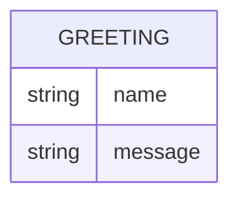

# Domain Model

Greeter has a single, transient concept: the greeting it produces for a caller-supplied name. Nothing is persisted.

- **Greeting** — not stored; computed per request from the `name` query parameter (or a generic default when omitted) and returned as the response body.

